# SQL-Lab1
### By Hajar Alamer
- Create a table "BooksAuthors" containing two fields (AuthorId, BookId)
  ``` sql
  CREATE TABLE BooksAuthors (
    AuthorId INT NOT NULL,
    BookId  INT NOT NULL
  );
  ```
  
- Insert at least 5 records into the BooksAuthors table.

``` sql
INSERT INTO booksauthors(
	authorid, bookid)
	VALUES (1, 1), (2, 2), (3, 3),(4, 4), (5, 5);
```


- Write a statement that will select the Country column from the Authors table.

``` sql
SELECT country
FROM authors;
```

  
- Select all the different values from the Country column in the Authors table.

``` sql
SELECT DISTINCT country
FROM authors;
```
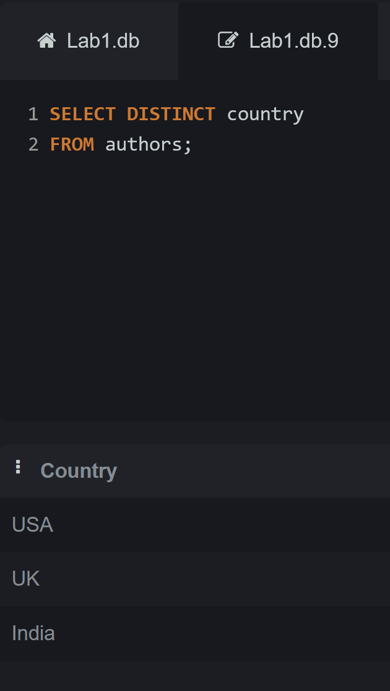
- Write an SQL query to return only Authors whose last name begins with S.

``` sql
SELECT name
FROM authors
WHERE name LIKE '% S%'
```
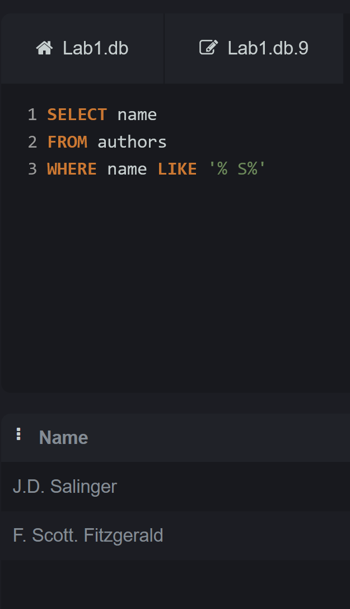
- List the number of Authors in each country.

``` sql
SELECT COUNT(id) as number_of_authers, country
FROM authors
GROUP BY country;
```
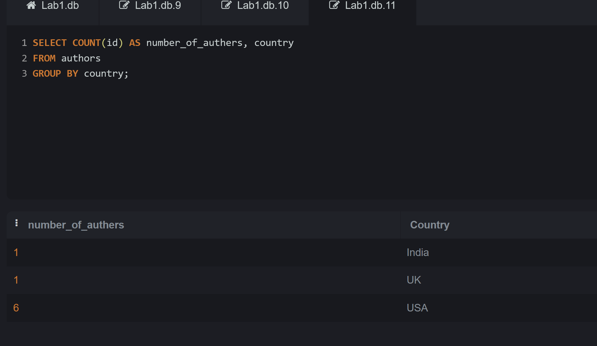
- Select all records from the Authors table, sort the result alphabetically by the column first name.

``` sql
SELECT *
FROM authors
ORDER BY name ASC;
```
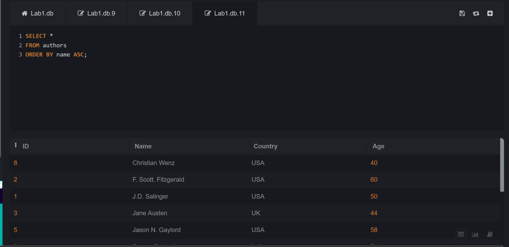
- Select all records from the Authors table, sort the result reversed alphabetically by the column last name.

``` sql
SELECT *
FROM authors
ORDER BY name DESC;
```
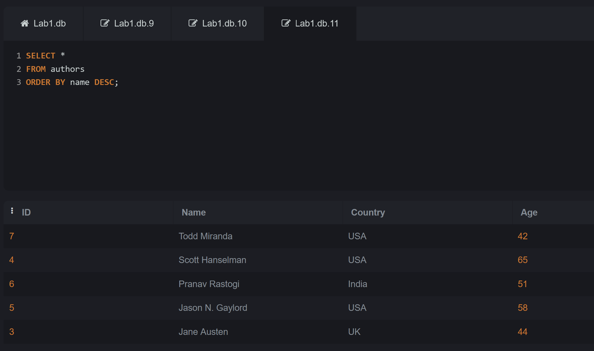
- Select all records where the Title column has the value ‘Great ' from the Books table.

``` sql
SELECT *
FROM books
WHERE title like '%Great%';
```
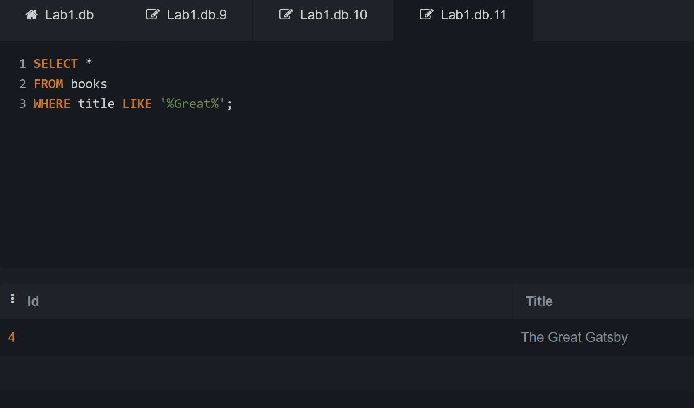
- Use the NOT keyword to select all records where the country is NOT "USA".

``` sql
SELECT *
FROM authors
WHERE country NOT LIKE 'USA'
```
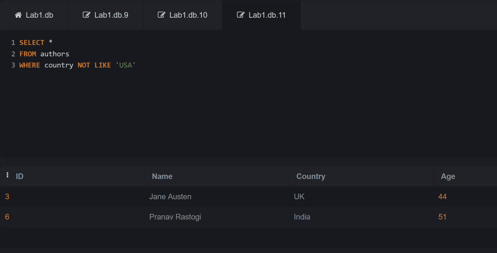
- Select all records where the country column has the value 'USA' or ‘India' from the “Authors” table

``` sql
SELECT *
FROM authors
WHERE country LIKE 'USA' OR country LIKE 'India';
```
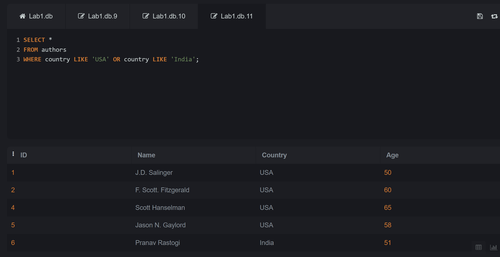

- Select all records where the age column has the value BETWEEN 50 - 60 in the “Authors” table.
``` sql
     SELECT *
      FROM authors
      WHERE age BETWEEN 50 AND 60;
```
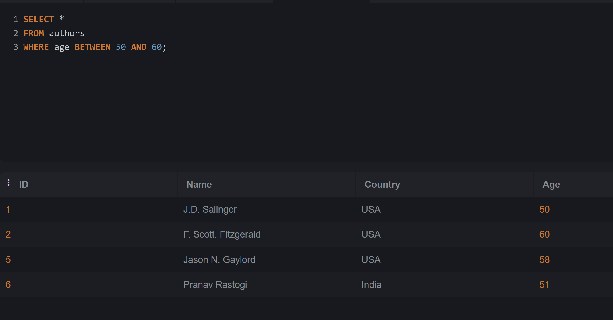

- Use the MIN function to select the record with the smallest value of the Age column from the “Authors” table.
``` sql
SELECT *
FROM authors
WHERE age = (SELECT MIN(age) FROM authors);
```
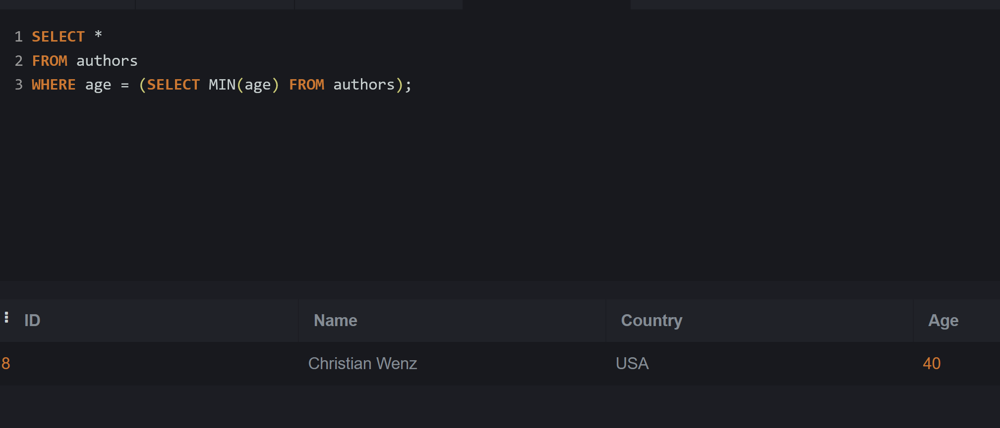

- Choose the correct `JOIN` clause to view all books and their authors.
  ` Nested INNER JOIN.`
``` sql
SELECT booksauthors.bookid, books.title, booksauthors.authorid, authors.name
FROM booksauthors
	INNER JOIN books
	ON books.id = booksauthors.bookid
		INNER JOIN authors
		on authors.id = booksauthors.authorid
```
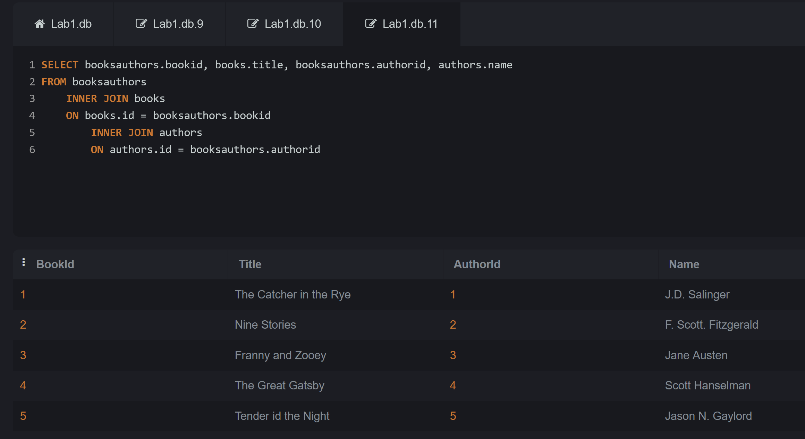
