# SQL-Lab1
- Create a table "BooksAuthors" containing two fields (AuthorId, BookId)
- CREATE TABLE BookAuthors (
  AuthorId int NOT NULL,
  BookId int NOT NULL,
  FOREIGN key (AuthorId) REFERENCES Authors(ID),
  FOREIGN KEY (BookId) REFERENCES Books(Id)
);

- Insert at least 5 records into the BooksAuthors table.
- INSERT INTO BookAuthors
(AuthorId, BookId)
VALUES
(1, 1),
(2, 2),
(3, 3),
(4, 4),
(5, 5);

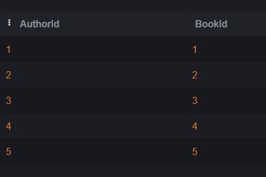

- Write a statement that will select the Country column from the Authors table.
- SELECT Country FROM Authors;

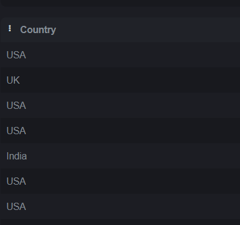

- Select all the different values from the Country column in the Authors table.
- SELECT DISTINCT Country FROM Authors;

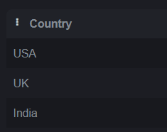

- Write an SQL query to return only Authors whose name begins with S.
- SELECT * from Authors WHERE Name LIKE "S%";

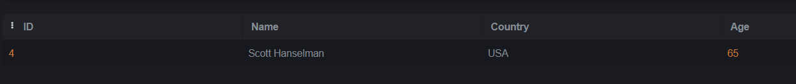

- List the number of Authors in each country.
- SELECT count(name), country
FROM Authors
GROUP by country;

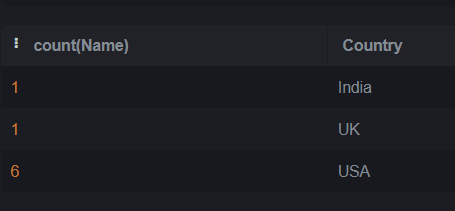

- Select all records from the Authors table, and sort the result alphabetically by the column's name.
- SELECT * FROM Authors
Order BY Name ASC;

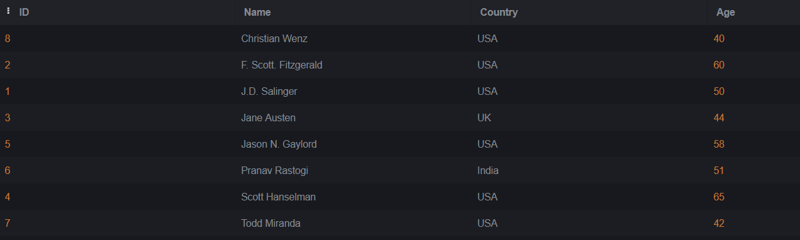

- Select all records from the Authors table, and sort the result reversed alphabetically by the column name.
- SELECT * FROM Authors
Order BY Name DESC;

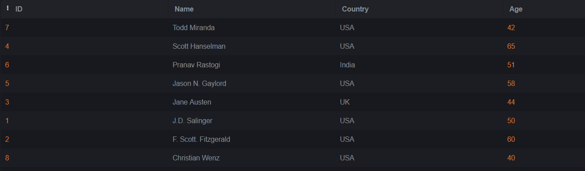

- Select all records where the Title column has the value ‘Great ' from the Books table.
- SELECT * FROM Books 
WHERE title like "%Great%";

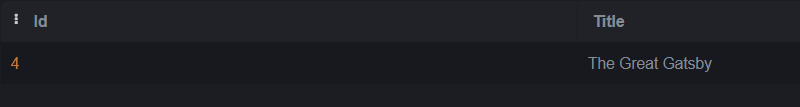

- Use the NOT keyword to select all records where the country is NOT "USA".
- SELECT * FROM Authors 
WHERE Country is not 'USA';

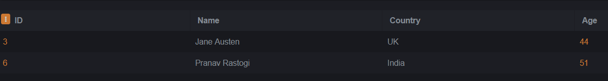

- Select all records where the country column has the value 'USA' or ‘India' from the “Authors” table
- SELECT * FROM Authors 
WHERE Country = "USA"
or 
Country = "India";

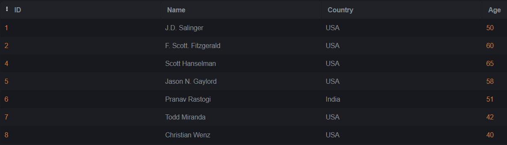

- Select all records where the age column has the value BETWEEN 50 - 60 in the “Authors” table.
- SELECT * FROM Authors
WHERE Age > 50
and Age < 60;

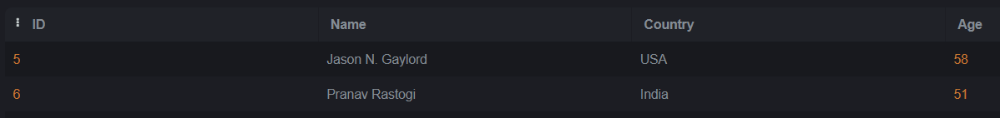

- Use the MIN function to select the record with the smallest value of the Age column from the “Authors” table.
- SELECT MIN(Age) from Authors;

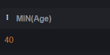

- Choose the correct `JOIN` clause to view all books and their authors.
- SELECT * FROM BookAuthors
JOIN Books On Books.Id = BookAuthors.BookId
JOIN Authors on Authors.ID = BookAuthors.authorid;

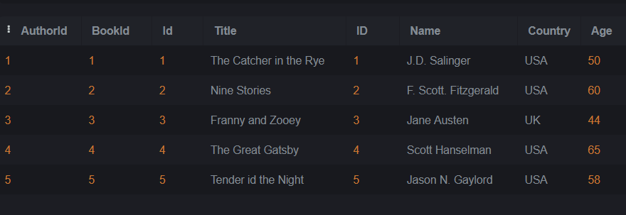