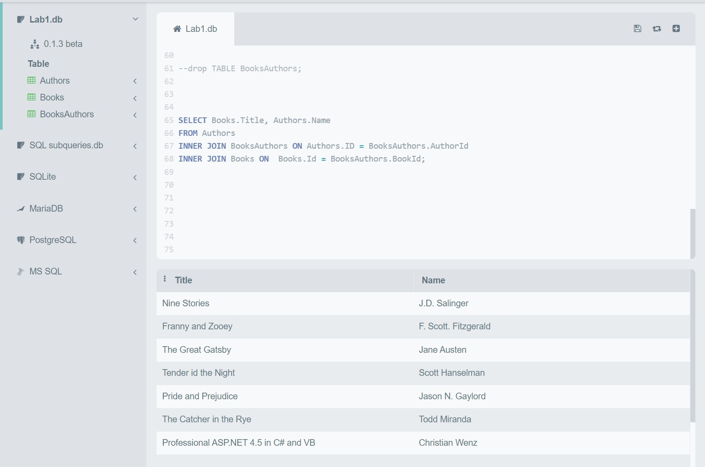

# SQL-Lab1
- Create a table "BooksAuthors" containing two fields (AuthorId, BookId)
- Insert at least 5 records into the BooksAuthors table.
- Write a statement that will select the Country column from the Authors table.
- Select all the different values from the Country column in the Authors table.
- Write an SQL query to return only Authors whose name begins with S.
- List the number of Authors in each country.
- Select all records from the Authors table, and sort the result alphabetically by the column's name.
- Select all records from the Authors table, and sort the result reversed alphabetically by the column name.
- Select all records where the Title column has the value ‘Great ' from the Books table.
- Use the NOT keyword to select all records where the country is NOT "USA".
- Select all records where the country column has the value 'USA' or ‘India' from the “Authors” table
- Select all records where the age column has the value BETWEEN 50 - 60 in the “Authors” table.
- Use the MIN function to select the record with the smallest value of the Age column from the “Authors” table.
- Choose the correct `JOIN` clause to view all books and their authors.

-- Q1
CREATE TABLE BooksAuthors (
  AuthorId INT,
  BookId INT,
  PRIMARY KEY (AuthorId, BookId),
  FOREIGN KEY (AuthorId) REFERENCES Authors(ID),
  FOREIGN KEY (BookId) REFERENCES Books(ID)
);

--Q2
INSERT INTO BooksAuthors (AuthorId, BookId)
VALUES
  (1, 2),
  (2, 3),
  (3, 4),
  (4, 5),
  (5, 6),
  (7, 1),
  (8, 7);
 

SELECT * FROM BooksAuthors;

 
--Q3
SELECT country FROM Authors;

--Q4
SELECT DISTINCT country FROM Authors;

 --Q5
SELECT * FROM Authors
WHERE name LIKE 'S%' ;

 --Q6
 SELECT * ,COUNT(id) FROM Authors GROUP BY country ;
 
 --Q7
 SELECT * FROM Authors ORDER BY name DESC;
 
 --Q8
 SELECT * FROM Authors ORDER BY name ASC;
 
 --Q9
 SELECT * FROM Books WHERE title LIKE '%Great%' ;
 
 --Q10
 SELECT * FROM Authors WHERE country is NOT "USA";
 
 --Q11 
 SELECT * FROM Authors WHERE country ="USA" or country ="India";
 
 --Q12
 SELECT * FROM Authors WHERE age BETWEEN 50 AND 60 ;
 
--Q13
 SELECT * ,MIN(age) FROM Authors ;
 
 --Q14  

SELECT Books.Title, Authors.Name
FROM Authors
INNER JOIN BooksAuthors ON Authors.ID = BooksAuthors.AuthorId
INNER JOIN Books ON  Books.Id = BooksAuthors.BookId;

--q14-photo

