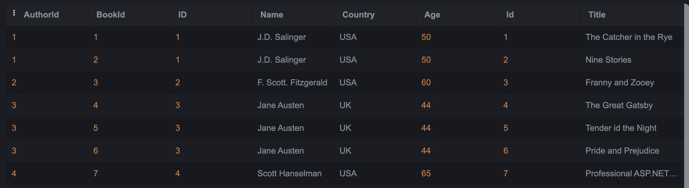

# SQL-Lab1
- Create a table "BooksAuthors" containing two fields (AuthorId, BookId)
The query 1 :

- Insert at least 5 records into the BooksAuthors table.
The query 2 :

  
- Write a statement that will select the Country column from the Authors table.
  The query 3 :

- Select all the different values from the Country column in the Authors table.
  The query  4 :
  
- Write an SQL query to return only Authors whose name begins with S.
  The query  5 :

  
- List the number of Authors in each country.
  The query  6 :
  
- Select all records from the Authors table, and sort the result alphabetically by the column's name.
  The query  7 :
  
- Select all records from the Authors table, and sort the result reversed alphabetically by the column name.
  The query  8 :
  
- Select all records where the Title column has the value ‘Great ' from the Books table.
  The query  9 :
  
- Use the NOT keyword to select all records where the country is NOT "USA".
  The query  10 :
  
- Select all records where the country column has the value 'USA' or ‘India' from the “Authors” table
  The query  11 :
  
- Select all records where the age column has the value BETWEEN 50 - 60 in the “Authors” table.
  The query  12 :
  
- Use the MIN function to select the record with the smallest value of the Age column from the “Authors” table.
  The query  13 :
  
- Choose the correct `JOIN` clause to view all books and their authors.
  The query  14 :
  
