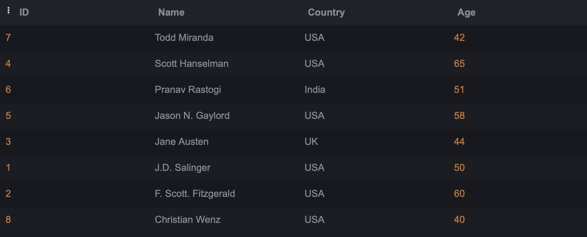

# SQL-Lab1
- Create a table "BooksAuthors" containing two fields (AuthorId, BookId)
```  sql 
CREATE TABLE BooksAuthors (
AuthorId INT , BookId INT ) ;
``` 

- Insert at least 5 records into the BooksAuthors table.
```  sql 
INSERT INTO BooksAuthors (AuthorId,BookId) VALUES (1,4) , 
(5,6) ,(5,8), (2,3),(1,8);
```
- Write a statement that will select the Country column from the Authors table.
```  sql 
SELECT country 
FROM Authors;
```
##### Output


- Select all the different values from the Country column in the Authors table.
```  sql 
SELECT DISTINCT country 
FROM Authors;
```
##### Output


- Write an SQL query to return only Authors whose name begins with S.
```  sql 
SELECT *
FROM Authors
WHERE name LIKE 'S%';
```
##### Output


- List the number of Authors in each country.
```  sql 
SELECT country, COUNT(*) AS 'Number of authors on each country'
FROM Authors
GROUP BY country;
```
##### Output


- Select all records from the Authors table, and sort the result alphabetically by the column's name.
```  sql
SELECT *
FROM Authors
ORDER BY name ;
```
##### Output


- Select all records from the Authors table, and sort the result reversed alphabetically by the column name.
```  sql
SELECT *
FROM Authors
ORDER BY name DESC;
```
##### Output


- Select all records where the Title column has the value ‘Great ' from the Books table.
```  sql
SELECT *
FROM Books
WHERE title LIKE '% Great %';
```
##### Output


- Use the NOT keyword to select all records where the country is NOT "USA".
```  sql
SELECT *
FROM Authors
WHERE NOT country='USA';
```
##### Output


- Select all records where the country column has the value 'USA' or ‘India' from the “Authors” table
```  sql
SELECT *
FROM Authors
WHERE country IN ('USA', 'India');
``` 
##### Output


- Select all records where the age column has the value BETWEEN 50 - 60 in the “Authors” table.
```  sql
SELECT *
FROM Authors
WHERE age BETWEEN 50 AND 60;
``` 
##### Output


- Use the MIN function to select the record with the smallest value of the Age column from the “Authors” table.
```  sql
SELECT *
FROM Authors
WHERE Age = (SELECT MIN(Age) FROM Authors);
``` 
##### Output


- Choose the correct `JOIN` clause to view all books and their authors.

``` sql 
SELECT s.* , A.Name
FROM Books S 
INNER JOIN Authors A 
On S.Id = A.ID;
``` 
##### Output
