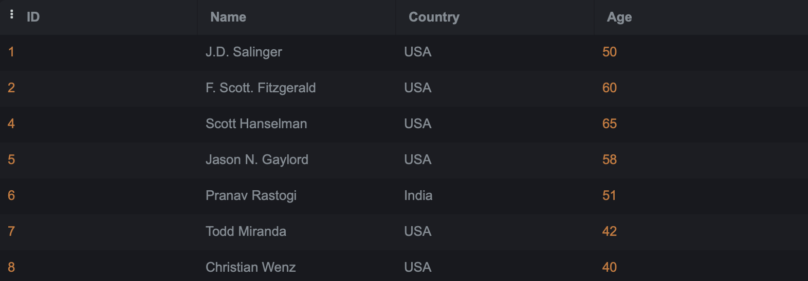

# SQL-Lab1
- Create a table "BooksAuthors" containing two fields (AuthorId, BookId)
  ``` sql
  CREATE TABLE BooksAuthors(
  AuthorId NOT NULL, 
  BookId NOT NULL);
  ```
- Insert at least 5 records into the BooksAuthors table.
  ``` sql
  INSERT INTO BooksAuthors 
  VALUES 
  (1,1),(1,2),(2,3),(3,4),(3,5),(3,6),(4,7);
  ```
- Write a statement that will select the Country column from the Authors table.
  ``` sql
  SELECT country 
  FROM Authors;
  ```
  
- Select all the different values from the Country column in the Authors table.
   ``` sql
   SELECT DISTINCT country 
   FROM Authors;
  ```
   
- Write an SQL query to return only Authors whose name begins with S.
   ``` sql
  SELECT * 
  FROM Authors
  WHERE name LIKE 'S%';
  ```
   
- List the number of Authors in each country.
   ``` sql
   SELECT country , COUNT(id)
   FROM Authors
   GROUP BY country;
  ```
   
- Select all records from the Authors table, and sort the result alphabetically by the column's name.
  ``` sql
  SELECT *
  FROM Authors
  ORDER BY name ASC;
  ```
  
- Select all records from the Authors table, and sort the result reversed alphabetically by the column name.
  ``` sql
  SELECT *
  FROM Authors
  ORDER BY name DESC;
  ```
  
- Select all records where the Title column has the value ‘Great ' from the Books table.
  ``` sql
  SELECT *
  FROM Books
  WHERE title LIKE '%Great%';
  ```
  
- Use the NOT keyword to select all records where the country is NOT "USA".
  ``` sql
  SELECT *
  FROM Authors
  WHERE country IS NOT 'USA';
  ```
  
- Select all records where the country column has the value 'USA' or ‘India' from the “Authors” table
  ``` sql
  SELECT *
  FROM Authors
  WHERE country LIKE '%USA%' or country LIKE '%India%';
  ```
  
- Select all records where the age column has the value BETWEEN 50 - 60 in the “Authors” table.
  ``` sql
  SELECT *
  FROM Authors
  WHERE age >= 50 and age <= 60;
  ```
  
- Use the MIN function to select the record with the smallest value of the Age column from the “Authors” table.
  ``` sql
  SELECT Name, MIN(age)
  FROM Authors;
  ```
  
- Choose the correct `JOIN` clause to view all books and their authors.
    ``` sql
  SELECT *
  FROM BooksAuthors
  JOIN Authors ON Authors.id = BooksAuthors.authorid
  JOIN Books ON Books.id = BooksAuthors.bookid;
  ```
    
